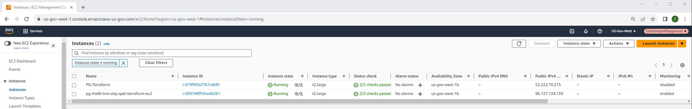
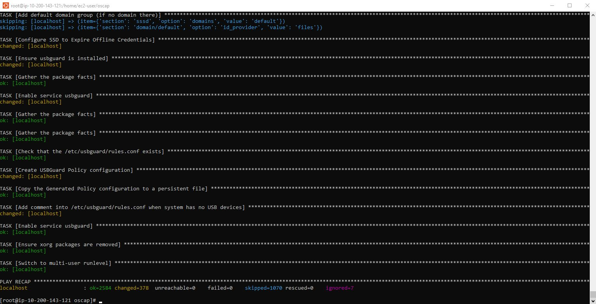

* This repository contains instructions on using STIG-Partitioned Enterprise Linux (spel) AMIs and Compliance As Code's ansible playbooks to perform a base STIG hardening in an effort to create a hardened Red Hat Enterprise Linux 8 hardened AMI/Gold Image. For any additional details or inquiries, please contact us at c.sargent-ctr@ecstech.com.
# Project Links
# [STIG Partitioned Enterprise Linux](https://github.com/plus3it/spel/tree/master)
# [Compliance As Code](https://github.com/ComplianceAsCode/content)
* Deployed Red Hat 8 on t2.large with public IP and using alpha_key_pair
* Note terraform and aws cli should be installed before proceeding

# Deploy EC2 and SG from spel ami
1. ssh -i alpha_key_pair.pem ec2-user@PG-TerraformPublicIP
2. cd /home/christopher.sargent/ && git clone https://github.com/ChristopherSargent/ecs_rhel8_lvm_stig_spel_ami.git
3. cd ecs_rhel8_lvm_stig_spel_ami/terraform && vim providers.tf
```
# Playground
provider "aws" {
  region = var.selected_region
  access_key = var.aws_access_key
  secret_key = var.aws_secret_key
}
```
4. vim alpha_key_pair.pem
```
# alpha_key_pair.pem.pem key is in AWS secrets manager in playground. Cut and paste key into this file and save
```
5. chmod 400 alpha_key_pair.pem
6. vim variables.tf
```
variable "aws_access_key" {
  type    = string
  default = "" # specify the access key
}
variable "aws_secret_key" {
  type    = string
  default = "" # specify the secret key
}
variable "selected_region" {
  type    = string
  default = "" # specify the aws region
}
# aws ssh key
variable "ssh_private_key" {
  default         = "alpha_key_pair.pem" # specify ssh key
  description     = "alpha_key_pair"
}
variable "vpc_id" {
  description = "The ID of the VPC."
  type        = string
  default     = "" # specfigy vpc id
}

variable "ami_id" {
  description = "The ID of the Amazon Machine Image (AMI) to use."
  type        = string
  default     = "ami-0b1aef95503ad8e3a"  # Provide a default AMI ID here spel-minimal-rhel-8-hvm-2023.07.1.x86_64-gp2
}

variable "availability_zone" {
  description = "The Availability Zone in which to launch the EC2 instance."
  type        = string
  default     = "us-gov-west-1a"  # Provide a default Availability Zone here
}

variable "subnet_id" {
  description = "The ID of the subnet."
  type        = string
  default     = "" #specfify subnet id
}

variable "ssh_cidr_blocks" {
  description = "List of allowed CIDR blocks for SSH."
  type        = list(string)
  default     = [""] #specify allowed public IP/32
}

variable "https_cidr_blocks" {
  description = "List of allowed CIDR blocks for HTTPS."
  type        = list(string)
  default     = [""] #specify allowed public IP/32
}

variable "instance_type" {
  description = "The type of EC2 instance to launch."
  type        = string
  default     = "t2.large" # specify instance type
}

variable "tags" {
  description = "A map of tags to apply to resources."
  type        = map(string)
  default = {
    Environment = ""                                   # specify Environment Dev, Prod ect.
    Name        = "pg-rhel8-lvm-stig-spel-terraform-ec2" # specify tag name
  }
}
```
7. vim main.tf
```
# Security Group
resource "aws_security_group" "default" {
  name        = "pg-rhel8-lvm-stig-spel-terraform-sg"
  description = "Used in the terraform"
  vpc_id      = var.vpc_id

  ingress {
    from_port   = 22
    to_port     = 22
    protocol    = "tcp"
    cidr_blocks = var.ssh_cidr_blocks
  }

  ingress {
    from_port   = 443
    to_port     = 443
    protocol    = "tcp"
    cidr_blocks = var.https_cidr_blocks
  }

  egress {
    from_port   = 0
    to_port     = 0
    protocol    = "-1"
    cidr_blocks = ["0.0.0.0/0"]
  }
}

# EC2 instance
resource "aws_instance" "pg-rhel8-lvm-stig-spel-terraform-ec2" {
  ami                         = var.ami_id
  associate_public_ip_address = true # Enable/disable pibluc IP
  availability_zone           = var.availability_zone
  enclave_options {
    enabled = false
  }

  get_password_data                    = false
  hibernation                          = false
  instance_initiated_shutdown_behavior = "stop"
  instance_type                        = var.instance_type
  ipv6_address_count                   = 0
  key_name                             = "alpha_key_pair"

  maintenance_options {
    auto_recovery = "default"
  }

  metadata_options {
    http_endpoint               = "enabled"
    http_put_response_hop_limit = "1"
    http_tokens                 = "optional"
    instance_metadata_tags      = "disabled"
  }

  monitoring = true

  root_block_device {
    delete_on_termination = true
    encrypted             = true
    kms_key_id            = "arn:aws-us-gov:kms:us-gov-west-1:036436800059:key/23051040-d05e-4080-99f6-bbd740bb1b14"
    volume_size           = 128
    volume_type           = "gp2"
  }

  source_dest_check = true
  subnet_id         = var.subnet_id
  tenancy                = "default"
  vpc_security_group_ids = ["${aws_security_group.default.id}"]

  tags = var.tags
}
```
8. terraform init && terraform plan --out pg-rhel8-lvm-stig-spel.out
9. terraform apply pg-rhel8-lvm-stig-spel.out
10. https://console.amazonaws-us-gov.com > EC2 > pg-rhel8-lvm-stig-spel-terraform-ec2 and verify instance is up



11. https://console.amazonaws-us-gov.com > EC2 > pg-rhel8-lvm-stig-spel-terraform-ec2 > Actions > Security > Modify IAM role > cdm3-ec2RoleForSSM > Update role

# Update local user password via SSM
1. https://console.amazonaws-us-gov.com > EC2 > pg-rhel8-lvm-stig-spel-terraform-ec2 > Connect to Session Manager
2. sudo -i
3. passwd maintuser
4. dnf update -y && reboot

# Hardening compliance as code
1. ssh -i maintuser@PublicIP
2. sudo -i
3. dnf install scap-security-guide ansible git vim -y
4. mkdir -p /home/ec2-user/oscap && cd /home/ec2-user/oscap

# Add time stamp to terminal and history
1. echo "export PROMPT_COMMAND='echo -n \[\$(date +%F-%T)\]\ '" >> /etc/bashrc && echo "export HISTTIMEFORMAT='%F-%T '" >> /etc/bashrc && source /etc/bashrc

# Add ansible logging
1. ansible-config init --disabled -t all > /etc/ansible/ansible.cfg && cp /etc/ansible/ansible.cfg /etc/ansible/ansible.cfg.ORIG
2. sed -i -e 's|;log_path=|log_path= /var/log/ansible.log|g' /etc/ansible/ansible.cfg

# Fix ec2-user
1. adduser ec2-user
2. cd /home/ec2-user/ && mkdir .ssh && chmod 700 .ssh
3. cd .ssh && vi authorized_keys
ssh-rsa AddPublicKeyHere alpha_key_pair

4. chmod 600 authorized_keys
5. usermod -aG wheel ec2-user
6. chown -R ec2-user:ec2-user /home/ec2-user/
7. visudo #Uncomment # %wheel ALL=(ALL) NOPASSWD: ALL or you wont be able to sudo after hardening
## Same thing without a password
%wheel  ALL=(ALL)       NOPASSWD: ALL

# Pre hardening [OSCAP Report](https://github.com/ChristopherSargent/ecs_rhel8_lvm_stig_spel_ami/tree/main/reports)
* Note the pre hardening oscap score is 49%
1. cd /home/ec2-user/oscap/
* Run oscap
```
oscap xccdf eval --profile xccdf_org.ssgproject.content_profile_stig --results-arf /home/ec2-user/oscap/pg-rhel8-ami-spel-oscap-pre.xml --report /home/ec2-user/oscap/pg-rhel8-ami-spel-oscap-pre.report.html --fetch-remote-resources --oval-results /usr/share/xml/scap/ssg/content/ssg-rhel8-ds-1.2.xml
```
2. chown -R ec2-user:ec2-user /home/ec2-user/
3. exit && exit
4. mkdir RHEL8-LVM-STIG-SPEL-08172023-CAS/pg/reports && cd RHEL8-LVM-STIG-SPEL-08172023-CAS/pg/reports
5. scp -i /root/ecs/alpha_key_pair.pem ec2-user@PublicIP:oscap/pg-rhel8-ami-spel-oscap-pre.report.html .

# Hardening
1. cd /home/ec2-user/
2. git clone https://github.com/ChristopherSargent/ecs_compliance_as_code.git
3. cd ecs_compliance_as_code/playbooks
4. cp /home/ec2-user/ecs_compliance_as_code/playbooks/rhel8-playbook-stig2-fixed.yml /usr/share/scap-security-guide/ansible/ && chmod 644 /usr/share/scap-security-guide/ansible/rhel8-playbook-stig2-fixed.yml
5. cp /etc/ssh/sshd_config /etc/ssh/sshd_config.08192023
6. ansible-playbook -i "localhost," -c local /usr/share/scap-security-guide/ansible/rhel8-playbook-stig2-fixed.yml
```
localhost                  : ok=2626 changed=437  unreachable=0    failed=0    skipped=1027 rescued=0    ignored=3
```



# Fix visudo 
1. visudo #Uncomment # %wheel ALL=(ALL) NOPASSWD: ALL or you wont be able to sudo after hardening
## Same thing without a password
%wheel  ALL=(ALL)       NOPASSWD: ALL

# Post additional hardening [OSCAP Report](https://github.com/ChristopherSargent/ecs_rhel8_lvm_stig_spel_ami/tree/main/reports)
* Note the ost hardening oscap score is 91%
1. cd /home/ec2-user/oscap
* Run oscap
```
oscap xccdf eval --profile xccdf_org.ssgproject.content_profile_stig --results-arf /home/ec2-user/oscap/pg-rhel8-ami-spel-oscap-post.xml --report /home/ec2-user/oscap/pg-rhel8-ami-spel-oscap-post.report.html --fetch-remote-resources --oval-results /usr/share/xml/scap/ssg/content/ssg-rhel8-ds-1.2.xml
```
3. chown -R ec2-user:ec2-user /home/ec2-user 
4. exit && exit 
4. mkdir RHEL8-LVM-STIG-SPEL-08172023-CAS/pg/reports && cd RHEL8-LVM-STIG-SPEL-08172023-CAS/pg/reports
5. scp -i /root/ecs/alpha_key_pair.pem ec2-user@PublicIP:oscap/pg-rhel8-ami-spel-oscap-post.report.html .
