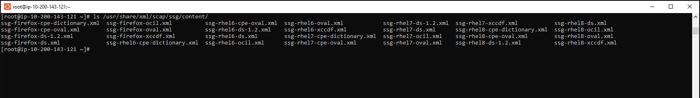
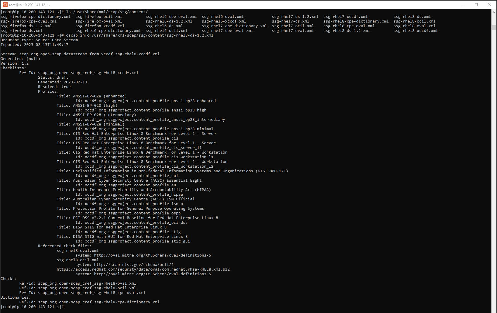
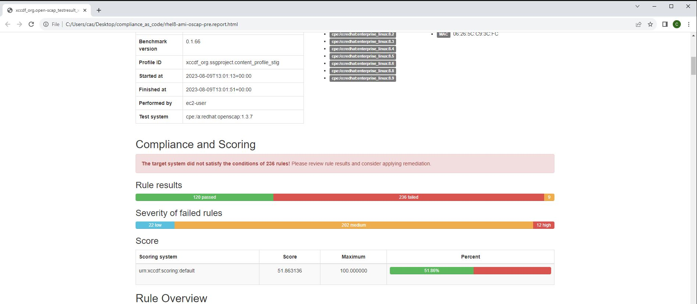
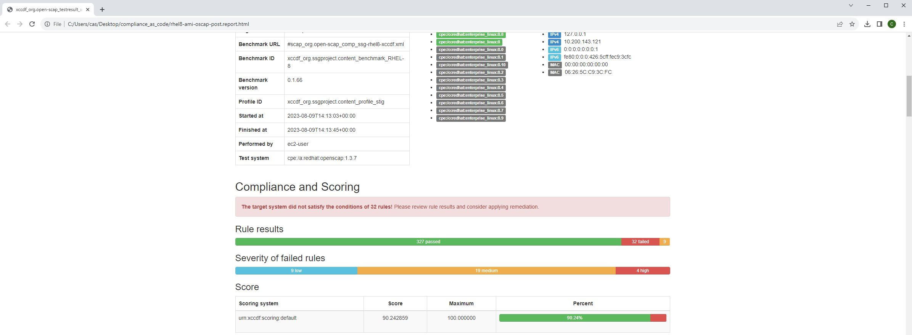

* This repository contains instructions on using compliance as code's ansible playbooks to perform a base STIG hardening in an effort to create a hardened AMI/Gold Image. For any additional details or inquiries, please contact us at c.sargent-ctr@ecstech.com.
# [ComplianceAsCode](https://github.com/ComplianceAsCode/content)
* Deployed Red Hat 8 on t2.large with public IP and using alpha_key_pair

# Install ssm and compliance as code

1. ssh -i alpha_key_pair.pem ec2-user@NewRhel8PublicIP
2. sudo -i
3. dnf install -y https://s3.amazonaws.com/ec2-downloads-windows/SSMAgent/latest/linux_amd64/amazon-ssm-agent.rpm && sudo systemctl enable amazon-ssm-agent && sudo systemctl start amazon-ssm-agent
4. dnf install scap-security-guide ansible -y
5. ls /usr/share/xml/scap/ssg/content/



6. oscap info /usr/share/xml/scap/ssg/content/ssg-rhel8-ds-1.2.xml



# Run oscap scan to get baseline score
7. mkdir -p /home/ec2-user/oscap && cd /home/ec2-user/oscap
* Run playbook 
```
oscap xccdf eval --profile xccdf_org.ssgproject.content_profile_stig --results-arf /tmp/arf.xml --report /home/ec2-user/oscap/rhel8-ami-oscap-pre.report.html --fetch-remote-resources --oval-results /usr/share/xml/scap/ssg/content/ssg-rhel8-ds-1.2.xml
```
8. chown -R ec2-user:ec2-user /home/ec2-user
9. scp -i "alpha_key_pair.pem" ec2-user@NewRhel8PublicIP:oscap/* .
* Open a second WSL terminal and cd to staging directory to pull file
10. Open report in browser



# Remidiate via ansible
11. cp /etc/ssh/sshd_config /etc/ssh/sshd_config.08092023
12. ansible-playbook -i "localhost," -c local /usr/share/scap-security-guide/ansible/rhel8-playbook-stig.yml
* Note it takes about 25 minutes to run


13. usermod -aG wheel ec2-user
14. visudo
* Uncomment # %wheel  ALL=(ALL)       NOPASSWD: ALL or you wont be able to sudo after hardening
```
## Same thing without a password
%wheel  ALL=(ALL)       NOPASSWD: ALL
```
15. cp /usr/share/scap-security-guide/ansible/rhel8-playbook-stig.yml /home/ec2-user/rhel8-playbook-stig-fixed.yml
* I had to fix the playbook and staged it in the playbooks directory
16. fips-mode-setup --enable

17. adduser christopher.sargent && usermod -aG wheel christopher.sargent && passwd christopher.sargent && reboot 
* Add local user

# Run oscap scan to post hardening score
18. ssh -i alpha_key_pair.pem ec2-user@NewRhel8PublicIP
19. sudo -i
20. fips-mode-setup --check
```
FIPS mode is enabled.
```
21. cd /home/ec2-user/oscap
* Run playbook 
```
oscap xccdf eval --profile xccdf_org.ssgproject.content_profile_stig --results-arf /tmp/arf.xml --report /home/ec2-user/oscap/rhel8-ami-oscap-post.report.html --fetch-remote-resources --oval-results /usr/share/xml/scap/ssg/content/ssg-rhel8-ds-1.2.xml
```
22. chown -R ec2-user:ec2-user /home/ec2-user
23. scp -i "alpha_key_pair.pem" ec2-user@NewRhel8PublicIP:oscap/* .
* Open a second WSL terminal and cd to staging directory to pull file
24. Open report in browser



* Note the rhel8-ami-oscap-pre.report.html and rhel8-ami-oscap-post.report.html are in the reports directory

# Use this repo
1. ssh -i alpha_key_pair.pem ec2-user@NewRhel8PublicIP
2. sudo -i
3. dnf install scap-security-guide ansible -y
4. mkdir -p /home/ec2-user/oscap && cd /home/ec2-user/oscap
* Run playbook 
```
oscap xccdf eval --profile xccdf_org.ssgproject.content_profile_stig --results-arf /tmp/arf.xml --report /home/ec2-user/oscap/rhel8-ami-oscap-pre.report.html --fetch-remote-resources --oval-results /usr/share/xml/scap/ssg/content/ssg-rhel8-ds-1.2.xml
```
5. cd /home && git clone git clone https://github.com/ChristopherSargent/ecs_compliance_as_code.git && cd ecs_compliance_as_code/playbooks
6. cp rhel8-playbook-stig-fixed.yml /usr/share/scap-security-guide/ansible/
7. cp /etc/ssh/sshd_config /etc/ssh/sshd_config.08092023
8. ansible-playbook -i "localhost," -c local /usr/share/scap-security-guide/ansible/rhel8-playbook-stig-fixed.yml
9. usermod -aG wheel ec2-user
10. visudo
* Uncomment # %wheel  ALL=(ALL)       NOPASSWD: ALL or you wont be able to sudo after hardening
```
## Same thing without a password
%wheel  ALL=(ALL)       NOPASSWD: ALL
```
11. fips-mode-setup --enable
12. adduser christopher.sargent && usermod -aG wheel christopher.sargent && passwd christopher.sargent && reboot 
* Add local user and reboot
13. ssh -i alpha_key_pair.pem ec2-user@NewRhel8PublicIP
14. sudo -i
15. fips-mode-setup --check
```
FIPS mode is enabled.
```
16. cd /home/ec2-user/oscap
* Run playbook 
```
oscap xccdf eval --profile xccdf_org.ssgproject.content_profile_stig --results-arf /tmp/arf.xml --report /home/ec2-user/oscap/rhel8-ami-oscap-post.report.html --fetch-remote-resources --oval-results /usr/share/xml/scap/ssg/content/ssg-rhel8-ds-1.2.xml
```
17. chown -R ec2-user:ec2-user /home/ec2-user
18. scp -i "alpha_key_pair.pem" ec2-user@NewRhel8PublicIP:oscap/* .
* Open a second WSL terminal and cd to staging directory to pull file
19. Open report in browser


